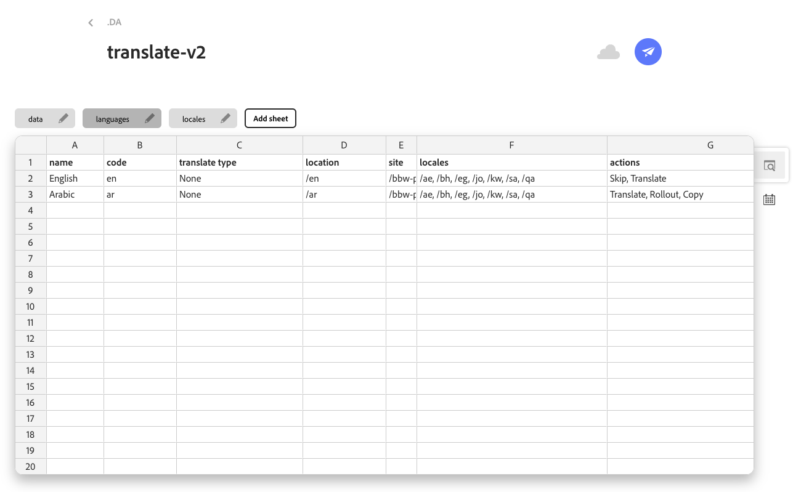
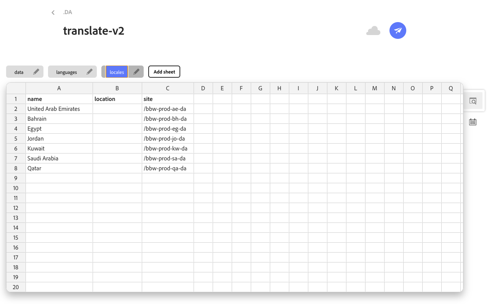

# Locales DA Plugin

## Overview

The Locales DA Plugin helps you manage multilingual content across your DA sites. This tool provides a centralized interface to view, create, edit, and publish content in different languages and locales, making it easy to maintain consistent multilingual experiences for your users.

## Features

- **Language Management**: View all configured languages and locales for your site
- **Content Status Tracking**: See which pages exist, are published, or need to be created in each language
- **Quick Actions**: Create, edit, and publish content directly from the plugin interface
- **Bulk Operations**: Publish multiple language versions at once

## How It Works

The plugin reads your site's language configuration from `/.da/translate-v2.json` and displays:

1. **Global Languages**: Languages configured at the site level
2. **Locales**: Regional variations of languages (e.g., English-US, English-UK, French-Canada)

For each language/locale, you can see:
- Whether the page exists in that language
- Current publication status in AEM
- Quick action buttons to create, edit, or publish content

It works with either a single site containing regions and language pages in subfolders, or multiple DA sites. For a multi-site setup, individual sites are created for each region, with one 'global' site acting as a blueprint.

## Usage

### Accessing the Plugin

1. Navigate to any page in your DA site
2. The plugin automatically loads and displays available languages and locales
3. You'll see two main sections:
   - **Global languages**: Site-wide language configurations
   - **Locales**: Regional language variations

### Working with Content

**Creating New Language Versions:**
- Click the "Create" button next to any language that doesn't have a page yet
- The plugin will copy the current page structure to the new language path
- You'll be redirected to the DA editor to customize the content

**Editing Existing Content:**
- Click the "Edit" button next to any existing language version
- You'll be taken directly to the DA editor for that language

**Publishing Content:**
- Click "Publish" to publish individual language versions
- Use "Publish all" to publish all languages in a locale group at once
- The plugin shows publication status with color-coded indicators

### Understanding Publish Status Indicators

- **Red icon**: Content is published to EDS and live
- **Grey icon**: Content exists in DA but isn't published

Hovering over the icon displays the most recently published timestamp.

## Configuration

The plugin can be enabled via the [DA library configuration sheet](https://docs.da.live/administrators/guides/setup-library#config-sheet). The plugin automatically reads your language configuration from `/.da/translate-v2.json`. It can be configured with an optional `global` parameter to load a central configuration sheet, such as one from the 'global' site. Like `?global=/alshaya-axp/bbw-prod-global-da`.

This file should contain two tabs `languages` and `locales`:

For details on the translation config see: https://docs.da.live/administrators/guides/setup-translation

## Troubleshooting

**Plugin not loading:**
- Ensure you're on a valid DA site with proper authentication
- Check that `/.da/translate-v2.json` exists and is properly formatted

**Languages not appearing:**
- Verify your language configuration file is accessible
- Check that the file contains valid JSON structure

**Publishing issues:**
- Ensure you have proper AEM publishing permissions
- Check that the target AEM instance is accessible

## Support

For technical support or questions about the Locales DA Plugin:

- Check the plugin's console output for error messages
- Ensure your DA project is properly configured in the library sheet
- Verify your language configuration file format
- Ensure all required permissions are in place

